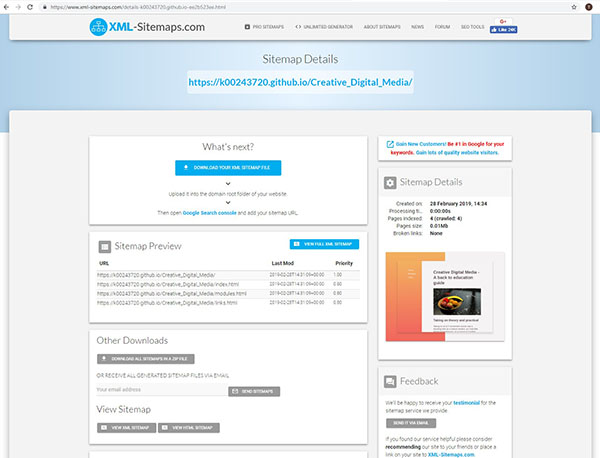

# Creative Digital Media 

This is a Github page for my Search Engine Optimisation module as part of my HDip in Creative Multimedia Programming at Limerick Institute of Technology. 

## Content

This page was created to use the keywords Creative Digital Media and employ various SEO techniques to get the page to finish as close to the top of a search engine display as possible.

## Visuals

This page was created using course content from Creative Multimedia Programming's modules, with extra information regarding my opinions on undertaking such a course as a mature student. I used some code from CodePen for the background styling, as I had been trying to learn about adding a two-tone background to a site, so this was a good time to learn.


                                                      
## Search Engine Optimisation 
Once the project was uploaded to Github, the real work of optimising the site began. I ran through various site tests, including GT Metrix, to see its performance and changed images accordingly, as some of them were too large and it was slowing down the site. I created a sitemap and using the Google Search Console, I installed Google Analytics and, later, Bing Webmaster Tools and then proceeded to run through BruceClay.com's search engine optimisation checklists, which were many, to see how well my page could display.
The following is now contained in my index header, which I would not have known previously: 

```bash
<head>
    <!-- Global site tag (gtag.js) - Google Analytics -->
<script async src="https://www.googletagmanager.com/gtag/js?id=UA-135351947-1"></script>
<script>
  window.dataLayer = window.dataLayer || [];
  function gtag(){dataLayer.push(arguments);}
  gtag('js', new Date());

  gtag('config', 'UA-135351947-1');
</script>

  <meta charset="utf-8">
    <meta name="msvalidate.01" content="947151A16F5F6A4C2EDEFA795D2BCD75" />
    <meta name=”description” content=”This website is the place to start reading if you want to study Creative Digital Media but are unsure about going back to college.”>
    <meta name="keywords" content="creative digital media, creative multimedia programming, digital media">
    <meta name="viewport" content="width=device-width, minimum-scale=1, maximum-scale=2">
```

I have learned a huge amount and, indeed, I am still learning, as it is an ongoing process to update the site and keep it relevent.




## Ackowledgements
As a beginner in search engine optimisation, it was great to get so much guidance from my lecturer at lIT in beginning the process  and then extending my knowledge base with the help of the following websites:
http://www.bruceclay.com/blog/seo-checklist/
https://moz.com/beginners-guide-to-seo/
http://www.tutorialspoint.com/seo/index.htm
http://backlinko.com/seo-techniques
http://www.shoutmeloud.com/on-page-seo.html